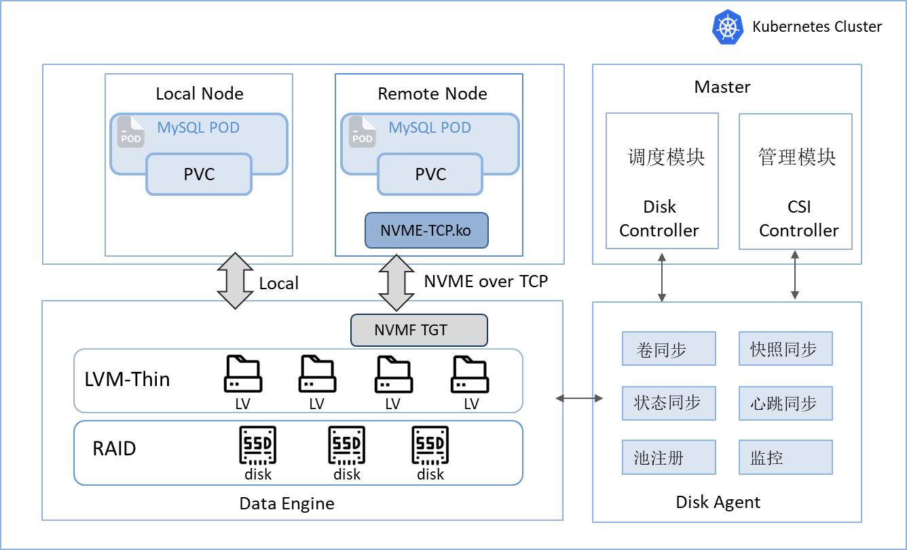

<b>云原生存储解决方案</b>

  [<a href="README.md">中文</a>] | [<a href="README-en.md">English</a>] 

# SLiteIO 
本项目基于[eosphoros-ai/liteio]开发，遵循Apache-2.0 license协议。
**SLiteIO** 是一款云原生有状态容器化的存储解决方案，依赖于LVM存储引擎，可作为本地卷直接使用，也可通过SPDK导出NVME-OF远端卷。由于其极简的存储IO路径，即使是普通SSD也能发挥出不错的性能。该方案专为超融合架构下的 Kubernetes 设计，可实现集群范围的块设备动态供给。

## 特性

1. **低门槛**: 不仅支持NVME和RDMA网络，满足对极致高性能的追求；还支持普通SSD和网络，也能提供不俗的性能，为初创企业或者设备利旧提供便利。                                                                                                                                                                                                      
2. **云原生**: SLiteIO通过CSI控制器和驱动实现与Kubernetes集成，提供云原生用户接口。用户可以通过PVC动态分配和销毁SLiteIO卷。
3. **易安装**: 除了一些少量的配置依赖，SLiteIO可以通过一条命令行快速的安装部署。
4. **极稳定**: 直接利用LVM作为数据引擎，本地卷直接访问，远端卷通过SPDK导出。整个运行时数据链路非常简单，从而带来极致的稳定。
5. **省成本**: 支持精简模式，可以做到存储空间用多少分配多少，避免过多分配带来的存储空间浪费。
6. **丰富的调度策略**: 支持跨节点、跨机柜、跨接入等多种高可用调度策略，满足不同等级的生产系统高可用要求。

## 目的

当前有很多系统运行在虚机或者物理机上，在集群到达一定规模后，存在大量的资源利用率失衡：比如有的节点出现CPU或内存不足，却有大量的存储闲置资源。因此在做容器化改造时，有状态的系统比如数据库采用哪种存储方案，充分利用这些闲置存储资源，成为新的难题。为解决这一问题，我们的目标是开发一种系统，能够在保持接近本地磁盘性能的同时，有效整合这些碎片化的存储资源。

## 架构

SLiteIO由六个组件组成：

1. **Disk-Agent**: Disk-Agent安装在每个后端节点上，并且管理该节点上的存储池，该模块与数据引擎交互，实现卷与快照的创建与删除功能。额外的，Disk-Agent还给控制节点上报了存储池状态并给Prometheus提供卷统计信息。
2. **Disk-Controller**: Disk-Controller掌握了集群种所有的存储池和卷的全局状态信息。它的主要任务时将卷调度到合适的存储池。
3. **nvme-tcp**: nvme-tcp是一个内核模块，提供了基于TCP的NVME-OF协议。
4. **nvmf_tgt**: nvmf_tgt提供了将LVM卷导出成nvme target，从而实现远端卷。
5. **CSI-Driver**: CSI-Driver实现了Kubernetes CSI标准接口，并以Pod形式部署在计算节点上。它通过lvm和nvme-cli工具链实现与后端存储的连接。
6. **CSI-Controller**: CSI-Controller是个中心化服务，提供PV的创建于删除处理。 

总体而言，SLiteIO架构为云原生块存储提供了一种可扩展且高效的实现方案。通过多组件协同与接口抽象，该架构能够灵活适配不同存储场景的需求。

## 快速开始

快速开始指南帮助您快速安装一个K8s集群，并在上面部署SLiteio。

- [快速开始](doc/zh/install.md)
- [使用kubeadm安装K8s](doc/zh/kubeadm-install.md)

## MYSQL数据库场景性能测试
**测试环境**：40C/256G，7 * 900GB SSD Raid5，2 * 10Gb   3台                    
**测试工具**：Sysbench               
**测试方法**：通过Kubernetes容器化场景和KVM虚拟化场景进行对比测试                                                                                               
**性能测试场景**：K8S + SLiteIO 本地卷 、K8S + SLiteIO 远端卷、KVM 本地卷

创建5对一主一从8C/16G/75GB的MYSQL实例，初始创建300张表，每张表插入100万条测试数据，通过Sysbentch模拟8、16、32、64、128线程并发分别进行只读、只写和混合读写的测试，测试时长180S。 

### 只读（oltp_read_only）     

Unit: TPS

|    Threads  |  K8S + SLiteIO Local | K8S + SLiteIO Remote | KVM Local |
|-------------|-------------|----------|----------|
| 8   | 8441.26       | 8452.56   | 2659.97  |
| 16  | 9533.01       | 9597.72   | 3478.41  |
| 32  | 9656.76       | 9625.8    | 4082.99  |
| 64  | 9843          | 9850      | 4577.7   |
| 128 | 9623.68       | 9623.37   | 5002.31  |

### 只写（oltp_write_only）

Unit: TPS

|    Threads  |  K8S + SLiteIO Local | K8S + SLiteIO Remote | KVM Local |
|-------------|-------------|----------|----------|
| 8   | 13409.11     | 7926.2   | 8694.35  |
| 16  | 17677.05     | 12203.34 | 12237.73 |
| 32  | 20760.74     | 17277.57 | 15532.35 |
| 64  | 21864.19     | 20428.38 | 17265.81 |
| 128 | 25056.6      | 24343.81 | 19032.64 |

### 读写（oltp_read_write）

Unit: TPS

|    Threads  |  K8S + SLiteIO Local | K8S + SLiteIO Remote | KVM Local |
|-------------|-------------|----------|----------|
| 8   | 5159.63     | 4355.29  | 2077.54|
| 16  | 6115.72     | 5908.65  | 2499.74|
| 32  | 6339.87     | 6365.55  | 2904.73|
| 64  | 6861.48     | 6851.73  | 3254.35|
| 128 | 6997.42     | 6989.52  | 3658.97|

总体来说，MYSQL容器化使用SLiteIO存储方案，在并发较高时，本地卷和远程卷的性能几乎持平。并且容器化后的性能远超出虚拟化场景。

## 应用场景
区别于传统分布式存储，Sliteio本身没有做数据冗余，因此适用于业务或上层中间件自身有数据冗余机制的场景下，比如数据库、分布式缓存等。Sliteio特别适合容器化的场景的有状态服务，预算有限需要利旧传统服务器，可以充分的利用和分配存储资源，并获得不错的性能。

## 高级主题

- [构建指南](doc/zh/build.md)
- [插件定制指南](doc/zh/plugins.md)

## 发展路线

## 联系我们

**邮箱**：13515105030@163.com
