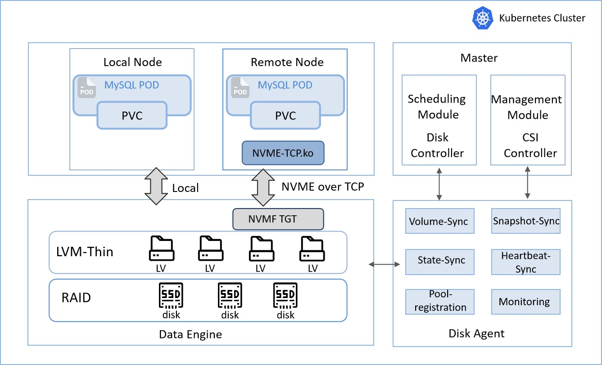

# SLiteIO 

This project is developed based on **[eosphoros-ai/liteio]** and follows the **Apache-2.0 license**.

**SLiteIO** is a cloud-native, stateful containerized storage solution that relies on the LVM storage engine. It can be used directly as a local volume or export NVMe-oF remote volumes via SPDK. Thanks to its minimal I/O path, even standard SSDs can deliver excellent performance. This solution is specifically designed for Kubernetes in hyper-converged architectures, enabling dynamic provisioning of block devices across the entire cluster.

## Features

1. **Low Threshold**: Supports not only NVMe and RDMA networks for high performance, but also standard SSDs and networks, delivering excellent performance and making it convenient for startups or device repurposing.
2. **Cloud-native**: LiteIO integrates with Kubernetes through CSI controller and driver, providing a cloud-native user interface. Users can dynamically allocate or destroy LiteIO volumes using PVC.
3. **Easy Installation**: With only a few configuration dependencies, SLiteIO can be quickly installed and deployed with a single command.
4. **Cost-Effective**: Directly leverages LVM as the data engine, with local volumes accessed directly and remote volumes exported via SPDK. The entire runtime data path is extremely simple, delivering exceptional stability.
5. **High Stability**:Supports thin provisioning, allocating storage space only as needed and avoiding waste from over-allocation.
6. **Rich Scheduling Policies**:Supports various high-availability scheduling policies across nodes, racks, and access points, meeting the high-availability requirements of different levels of production systems.

---

## Architecture

SLiteIO consists of six main components:

1. **Disk-Agent**: The Disk-Agent is installed on each backend node and manages the StoragePool on that node. It interacts with the data engine to create and delete volumes and snapshots. Additionally, the Disk-Agent reports the status of the StoragePool to the control node and provides volume statistics to Prometheus.
2. **Disk-Controller**: The Disk-Controller is aware of all the StoragePools and Volumes in the cluster. Its primary responsibility is to schedule a requested volume to a suitable StoragePool.
3. **nvme-tcp**: nvme-tcp is a kernel module that provides the NVMe-oF protocol over TCP.
4. **nvmf_tgt**: nvmf_tgt exports LVM volumes as NVMe targets, enabling remote volume access.
5. **CSI-Driver**: SLiteIO's CSI-Driver implements K8S CSI and is deployed as a DaemonSet pod on computing nodes. It utilizes the lvm and nvme-cli toolchains to connect to backend storage.
6. **CSI-Controller**: The CSI-Controller is a central service that handles the creation and deletion of PVs.

Overall, SLiteIO's architecture provides a scalable and efficient approach to cloud-native block storage. By utilizing multiple components and interfaces, LiteIO offers a flexible and configurable solution for various storage scenarios.

## Quick Start

- [Quick Start](install.md)
- [Installing K8s using kubeadm](kubeadm-install.md)

## MySQL Database Performance Test

**Test Environment**:40C/256G, 7 × 900GB SSD RAID5, 2 × 10GbE, 3 units

**Test Tool**: Sysbench

**Test Method**:Compare performance between K8S and KVM.

**Performance Test Scenarios**:K8S + SLiteIO local volume、K8S + SLiteIO remote volume、KVM local volume

**Test Setup**:
1. Create 5 pairs of master-slave MySQL instances (8C/16G/75GB);
2. Initially create 300 tables with 1 million test records each;
3. Use Sysbench to simulate 8, 16, 32, 64, and 128 threads for read-only, write-only, and mixed read-write tests. Each test lasts 180 seconds.

### oltp_read_only   

Unit: TPS

|    Threads  |  K8S + SLiteIO Local | K8S + SLiteIO Remote | KVM Local |
|-------------|-------------|----------|----------|
| 8   | 8441.26       | 8452.56   | 2659.97  |
| 16  | 9533.01       | 9597.72   | 3478.41  |
| 32  | 9656.76       | 9625.8    | 4082.99  |
| 64  | 9843          | 9850      | 4577.7   |
| 128 | 9623.68       | 9623.37   | 5002.31  |

### oltp_write_only

Unit: TPS

|    Threads  |  K8S + SLiteIO Local | K8S + SLiteIO Remote | KVM Local |
|-------------|-------------|----------|----------|
| 8   | 13409.11     | 7926.2   | 8694.35  |
| 16  | 17677.05     | 12203.34 | 12237.73 |
| 32  | 20760.74     | 17277.57 | 15532.35 |
| 64  | 21864.19     | 20428.38 | 17265.81 |
| 128 | 25056.6      | 24343.81 | 19032.64 |

### oltp_read_write

Unit: TPS

|    Threads  |  K8S + SLiteIO Local | K8S + SLiteIO Remote | KVM Local |
|-------------|-------------|----------|----------|
| 8   | 5159.63     | 4355.29  | 2077.54|
| 16  | 6115.72     | 5908.65  | 2499.74|
| 32  | 6339.87     | 6365.55  | 2904.73|
| 64  | 6861.48     | 6851.73  | 3254.35|
| 128 | 6997.42     | 6989.52  | 3658.97|

Overall, when MySQL is containerized with the SLiteIO storage solution, the performance of local volumes and remote volumes is nearly identical under high concurrency. Moreover, the containerized performance far exceeds that of the virtualized scenario.

## Target Scenario

Unlike traditional distributed storage systems, Sliteio does not implement data redundancy itself. Therefore, it is suitable for scenarios where the application or upper-layer middleware already implements its own data redundancy mechanisms, such as databases and distributed caches. 

SLiteIO is particularly well-adapted for stateful services in containerized environments. It enables efficient utilization and allocation of storage resources while delivering excellent performance, making it an ideal solution for organizations with limited budgets seeking to repurpose existing traditional servers.

## Advanced Topics

- [Build Guide](build.md)
- [How to Customize Plugins](plugins.md)

## Roadmap

