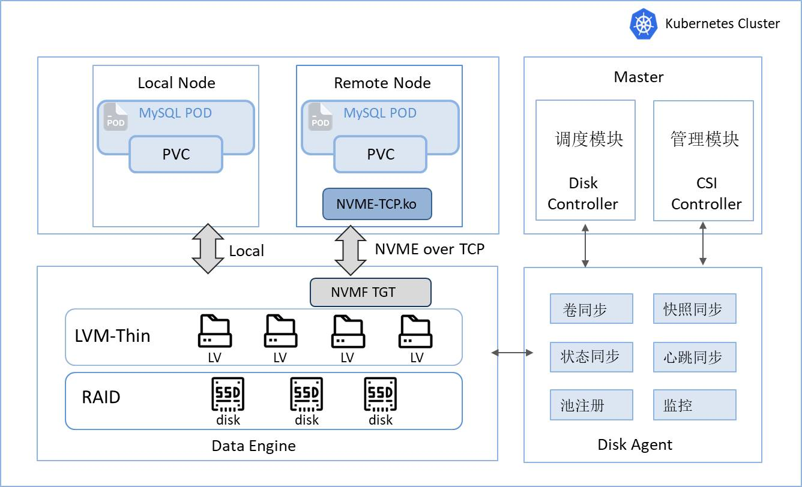

# 基于蚂蚁集团开源Liteio的定制版本

在Liteio开源仓库（https://github.com/eosphoros-ai/liteio） 的基础上，我们针对数据中心容器化改造，尤其是基于传统IT设备（普通网络、普通SSD）提供了一种存储解决方案。特别是在数据库容器化改造时，存储解决方案显得尤为重要。该版本我们应用于MySQL容器化，经过系统性测试验证，并逐步在企业生产环境进行推广。

# 什么是SLiteIO?

LiteIO 的设计初衷是提供一种高性能和可扩展的云原生块设备服务。但现实的情况是，很多数据中心有大量的利旧机器设备，使用万兆以太网络和普通SSD，这些企业并没有太多的预算去购买NVME SSD或者IB网络设备。所以Sliteio有了重新定位，给这些企业提供了容器存储解决方案。

## **设计背景**

很多企业为了降低成本和提高效率，都在使用容器代替传统的虚拟化方式。容器在无状态的应用中体现出较大优势，但在有状态服务中，例如数据库服务，需要采用哪种存储方案是一个难题。 如果选择本地存储，有以下两个问题:

- **不均匀利用率**：I/O密集型和计算密集型工作负载不同，导致一台机器可以完全用于计算，而存储仍然未充分利用，反之亦然。此外，通过调度获得全局最优解是一个相当大的挑战。
- **较差的可扩展性**: 当存储不足并且需要扩展存储时，迁移到具有较大存储容量的服务器变得至关重要，这需要很长时间来复制数据。

传统的分布式存储是一种不错的解决方案，但在数据库领域，它引入了几个问题：

- **复制计数递增**(成本): 分布式存储的优势在于通过擦除编码（EC）和多副本技术来池化存储，这两种技术为单个硬件故障提供了强大的保护。然而，数据库通常需要在上层的不同可用性区域（AZ）之间进行地理冗余和灾难恢复，而另一个AZ中已经存在备份复制，数据副本的总数将增加。
- **大爆炸半径**(稳定性): 分布式存储通常具有集中的元数据层，当发生故障时，可能会导致全局异常。

## **设计理念**

Sliteio的设计尽量简化数据路径，这样一方面降低时延，另一方面避免复杂的路径管理带来稳定性风险。Sliteio直接采用LVM作为数据引擎，加入了精简配置管理，并可以通过SPDK导出成远端卷，计算节点可以用过NVME OF TCP远程访问存储节点。点对点设计与Kubernetes的调度控制相结合，有效地减轻了单个硬件故障对服务的影响。

## **成本管理**

基于SLiteIO，可以根据需要将服务器中未分配的存储动态分发到远程计算节点，而全局协调的调度会池化全局存储资源，从而提高总体存储效率。
例如，有两种类型的服务器：计算密集型96C4T和存储密集型64C20T。假设存储模型的CPU已经分配，剩余5T磁盘空间，而计算模型仍然有可用的CPU，但没有要分配的磁盘。使用LiteIO，可以将计算模型的CPU与存储模型的剩余磁盘空间组合到一个新容器中来提供服务，从而提高计算和存储容量的效率。
## 存储计算分离

SLiteIO是一种通用存储服务技术，它作用于存储逻辑卷，与K8S一起，上层容器或应用程序感知的存储与本地磁盘的存储没有差别。无论是直接读取/写入块设备还是将块设备格式化为任何文件系统，都不需要上层服务进行修改。OceanBase、MySQL、PostgreSQL等数据库或用Java、Python或Go编写的应用程序可以将其用作常规磁盘。

## **无服务器架构**
SLiteIO的通用存算分离架构极大简化了系统扩展。通过其感知与调度系统，部署MySQL实例即可天然获得无服务器能力。当MySQL计算能力不足时，借助SLiteIO将MySQL存储挂载至更强大的容器，即可快速实现纵向扩展。

# **技术特点**

## **传输协议**
SLitelO使用NVMe oF进行跨节点数据传输，当没有NVME SSD设备和RDMA网络时，使用普通SSD和10Gb以太网卡也能提供不俗的性能。

## **简化的IO路径**
在传统的分布式存储体系结构中，写入IO操作涉及三个步骤：查询元数据、写入元数据和写入多个数据副本，这需要大量的网络交互。在SLitelO体系结构中，每个PVC和后端的块设备一对一映射，不需要额外的元数据管理和数据块管理。IO路径仅需要单次网络交互，消除了与多个副本写入相关的数据传输延迟和放大问题。这使得SLitelO具有更低且更稳定的I/O延迟。

## **多盘组合**
一对一的数据卷模式，当某个节点存储容量快用满时，不可避免地会剩余一些资源片段，Sliteio可以将这些片段聚合到单个卷中，以供业务使用。但这种使用方式要注意如果其中任意一个片段所在地磁盘损坏，则整个卷就可能不可用，所以建议重要业务尤其核心数据库避免使用这种方式。

## **精简配置**
SLitelO提供了精简配置模式，适合存储资源的超分配场景，在实际使用中，配合一定的超分比例和定义合适的调度策略，可以大幅度的提高存储资源利用率。

## **容量扩展**
SLitelO提供了容量扩展的功能。在和精简配置结合使用时，需考虑超分比的具体阈值，防止容量过分超分带来的隐患。

# **实践**
我们在MySQL容器化改造过程中，实践了基于SLiteio的存储方案。容器化后数据库读写都明显优于虚拟化场景下的本地存储读写，并且远程访问和本地访问的时延差别不大。

